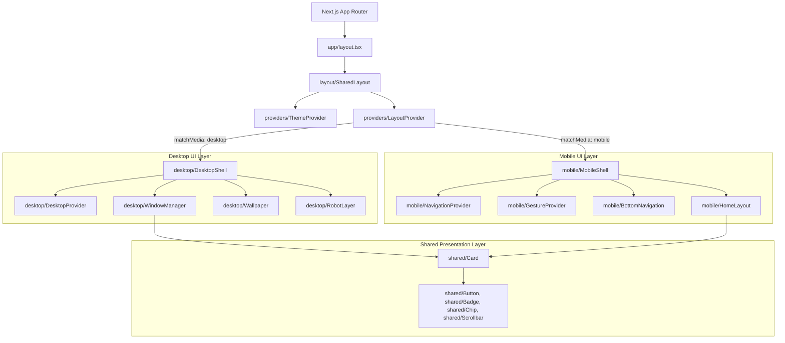
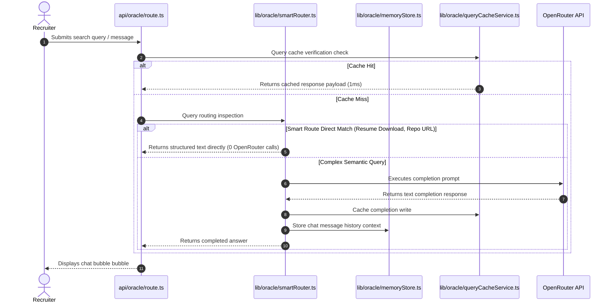

# Architectural Blueprint - Multiverse-OS

This document details the software architecture, visual shell segregation, and AI conversational workflows of the **Multiverse-OS** production platform.

---

## 1. System Topology Overview

---

## 2. Shell Segregation Strategy

To maximize visual efficiency and prevent layout calculations from clashing between devices, Multiverse-OS implements a **Strict Dual-Shell Architecture**:

* **Universal Orchestration (`SharedLayout`)**:
  Applies uniform global font weights, layout properties, and loads standard global CSS themes.
* **Responsive Control (`LayoutProvider`)**:
  Monitors viewport dimension changes dynamically. If the screen size changes across the desktop breakpoint (`min-width: 1024px`), it toggles the shell pointer state.
* **Desktop Workstation Shell (`DesktopShell`)**:
  Wraps the viewport in a non-scrollable workstation layout. Mounts the backing grids wallpaper, the floating interactive widgets, and provides windows focus contexts.
* **Mobile Touch Shell (`MobileShell`)**:
  Renders swipe-optimized navigation headers, mock status indicators, scrollable layout cells, and bottom sheet dialog drawers.

---

## 3. Conversational Oracle Engine Workflow

The Oracle assistant resolves user questions about repository code, experience history, and candidate skills. It utilizes caching, smart routing rules, and local narrative engines to prevent unneeded API hits.

### 3.1. Caching & Memory Storage
* **Query Cache**: Persistent JSON key-value store mapping normalized queries to text responses, preventing repeat LLM costs.
* **Context Memory**: Tracks conversation history inside `memoryStore` to support follow-up questions in the active session.

---

## 4. GitHub Sync & Refresh Manager
To keep project details live, the background sync service runs scheduled updates:
* **Background Worker**: Syncs project details (stars, issues, README content) to local storage.
* **Failover Mode**: If the live GitHub REST API fails or limits rates, the system loads local files (`data/github-sync-cache.json`) to keep routes functional.
