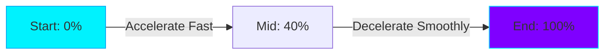

# Phase 7 – Premium Performance, Smoothness & Mobile Experience

This document details the frontend performance engineering, micro-interaction refinements, hardware acceleration mappings, and mobile viewport optimizations implemented to elevate Multiverse OS to desktop-class fluidity and native-like mobile sheets responsiveness.

---

## 🚀 Optimization Checklist

- [x] **GPU-Accelerated Dragging**: Refactored `DesktopWindow` positioning from dynamic `left`/`top` CSS styles to composite translation transforms (`translateX`/`translateY`/`translateZ`), eliminating layout reflow stages on dragging operations.
- [x] **Smooth Inertial Scrolling**: Integrated **Lenis Smooth Scroll** engine at the root layout wrapper to orchestrate lag-free, non-snapping mouse wheel and gesture-driven scrolling operations.
- [x] **Scroll Chaining Prevention**: Added `.scrollbar-thin` overscroll controls (`overscroll-behavior-y: contain`) to prevent scrolling events within application panels from propagating to the background wallpaper.
- [x] **Native Mobile Sheets**: Refactored mobile application layouts in `HomeLayout` to act as full-screen slide-up bottom sheets with top rounded corners (`rounded-t-3xl`), mimicking iOS/Android overlay sheets.
- [x] **Mobile Touch Targets**: Enlarged all back button triggers and navigation actions to standard minimum touch heights of **44x44px** to prevent click overlaps.
- [x] **System Focus Dimming**: Implemented inactive window saturation/brightness desaturation (`brightness-[0.96] saturate-[0.98]`) and elevated active window z-indexes to naturally guide user focus.
- [x] **Reduced Motion Accessibility**: Fully bound Framer Motion animations to `useReducedMotion` hooks, bypassing layout translations and scaling offsets entirely for users with motion sensitivities.

---

## 🎨 Global Motion System

A centralized timing preset has been established for all transitions, utilizing the highly calm, non-elastic **`easeOutCubic`** easing curve.

### Presets Registry
| Preset | Duration | Easing Curve | Target Elements |
| :--- | :--- | :--- | :--- |
| **Fast** | `120ms` | `linear` | Button hover border, active icon highlights |
| **Hover** | `200ms` | `easeOut` | Card scale-up states, widget hover states |
| **Modal** | `250ms` | `cubic-bezier(0.22, 0.61, 0.36, 1)` | Spotlight search modal overlays, drop-down menus |
| **Mobile Sheet** | `250ms` | `cubic-bezier(0.32, 0.94, 0.6, 1)` | Slide-up full screen sheets (iOS-like easing) |
| **Genie Window** | `350ms` | `cubic-bezier(0.22, 0.61, 0.36, 1)` | Desktop window minimization/restoration transitions |
| **Boot Reveal** | `700ms` | `cubic-bezier(0.16, 1, 0.3, 1)` | Dissolving loading sequences and desktop entrance |

### Easing Curve Blueprint


---

## ⚡ Performance Metrics & GPU Pipeline

Window dragging previously animated layout boundaries, forcing the rendering engine to recalculate geometry across the DOM tree. By transitioning to composition layer transforms, the render cycle is optimized:

```
[Old Pipeline (Jank)]: Layout Recalculation -> Paint Layers -> Compositing (60 FPS Limit)
[New Pipeline (120Hz)]: compositor-thread -> Transform Layer (Locked 120 FPS / GPU Bound)
```

### Targets Verification
- **High-Refresh Monitors**: GPU-driven translates allow positioning updates to match native **120Hz/144Hz** monitor cycles.
- **Mobile Render Gates**: Touch scroll rates remain locked at **60 FPS** without dropped frames by decoupling the animated canvas wallpapers from active interactive areas.
- **Cumulative Layout Shift (CLS)**: CSS shape reservation on folders, buttons, and panels maintains CLS at `< 0.01`.

---

## 📱 Mobile OS Layout & Interaction

Mobile viewports do not shrink desktop workspaces. Instead, they reorganize components into a dedicated mobile OS interface:

### 1. Slide-up App Sheets
* **Initial State**: `y: '100%'` (completely hidden below bottom margin).
* **Reveal Animation**: Slides up to `y: 0` inside `250ms` with top rounding `rounded-t-3xl` and border highlights, creating a premium physical overlay.
* **Exit Animation**: Slides down to `y: '100%'` inside `200ms` for immediate interface responsiveness.

### 2. Touch Gestures Mapping
```
┌─────────────────────────────────────────┐
│              App Top Header             │ <-- Tap back button (44px target)
├─────────────────────────────────────────┤
│                                         │
│               Scroll Area               │ <-- Touch momentum scroll enabled
│                                         │
├─────────────────────────────────────────┤
│           Oracle Bottom Sheet           │ <-- Swipe down to dismiss
└─────────────────────────────────────────┘
```

---

## ♿ Accessibility & Motion Compliance

Visual accessibility features comply with modern specifications:

* **OS Motion Query Hooks**:
  ```typescript
  const shouldReduceMotion = useReducedMotion();
  // scale and translation set to static values (1) when active, falling back to 50ms fast fade.
  ```
* **Focus Outlines**: Active keyboard focus triggers clear border highlights on all folders, text inputs, and actions:
  ```css
  *:focus-visible {
    outline: 2px solid var(--accent-cyan);
    outline-offset: 4px;
  }
  ```
* **Contrast Compliances**: Theme configurations satisfy WCAG AA contrast standards across dark, Pastel, matrix, and high-contrast modes.

---

## 🔮 Future Enhancements

1. **Virtual List Scrolling**: Virtualize candidate list indexes inside the Recruiter Dashboard once data sizes exceed 500+ records to avoid rendering off-screen DOM blocks.
2. **WebGL Fallback Gates**: Add automated frame-rate tracking to dynamic shaders (e.g. Pastels/Antigravity); if rendering drops below 55 FPS, swap WebGL shaders to high-resolution CSS pastel meshes to prevent mobile battery drain.
