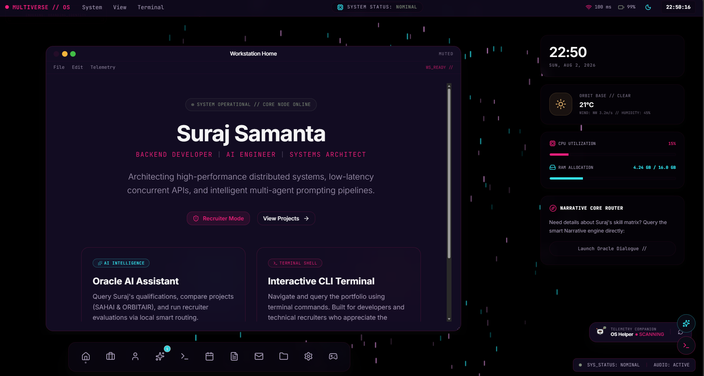
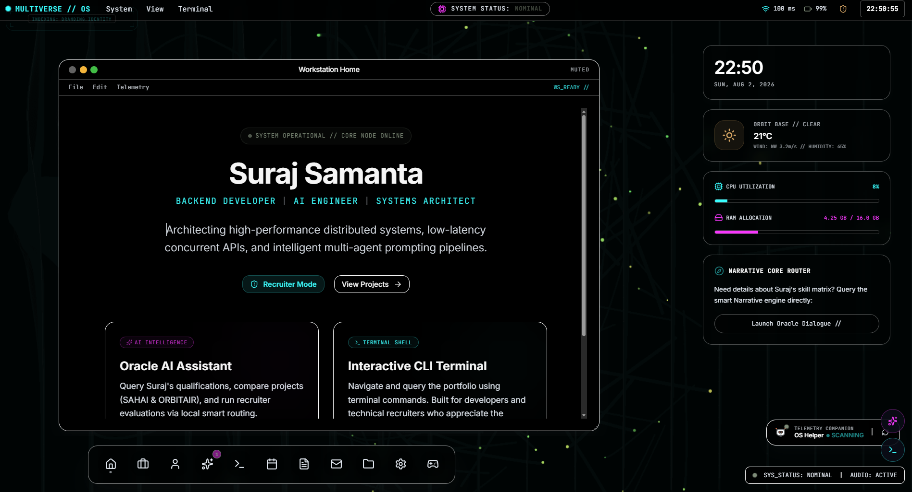
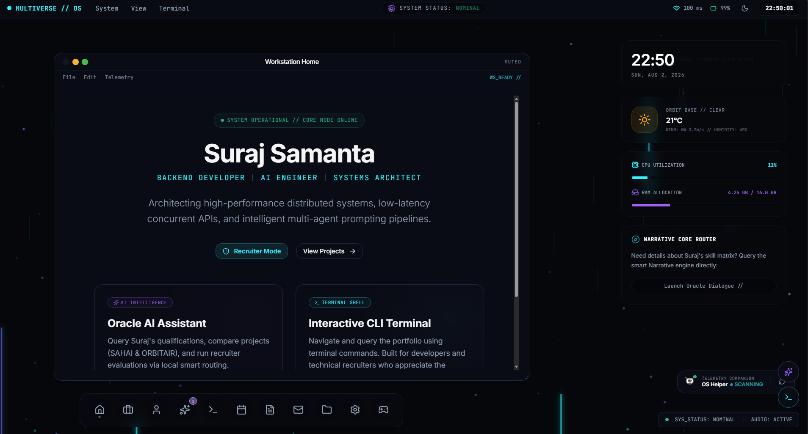
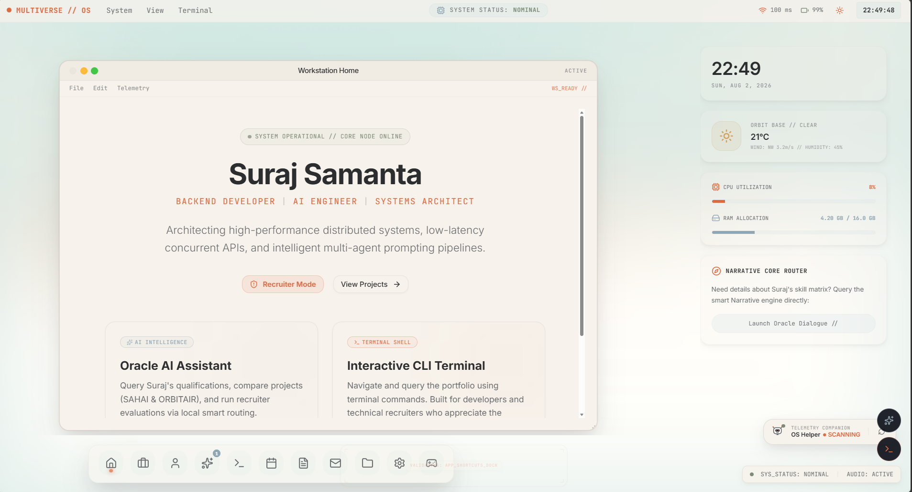
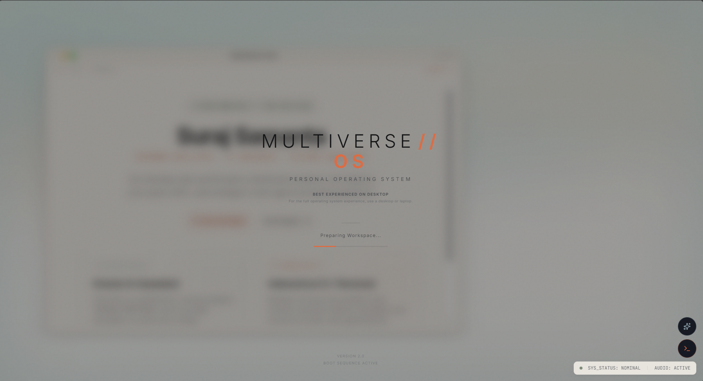
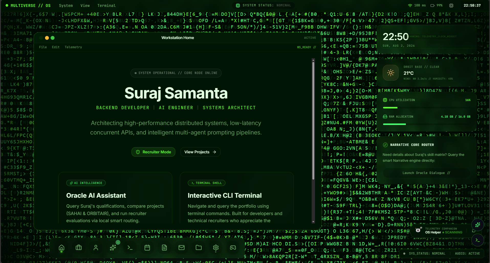
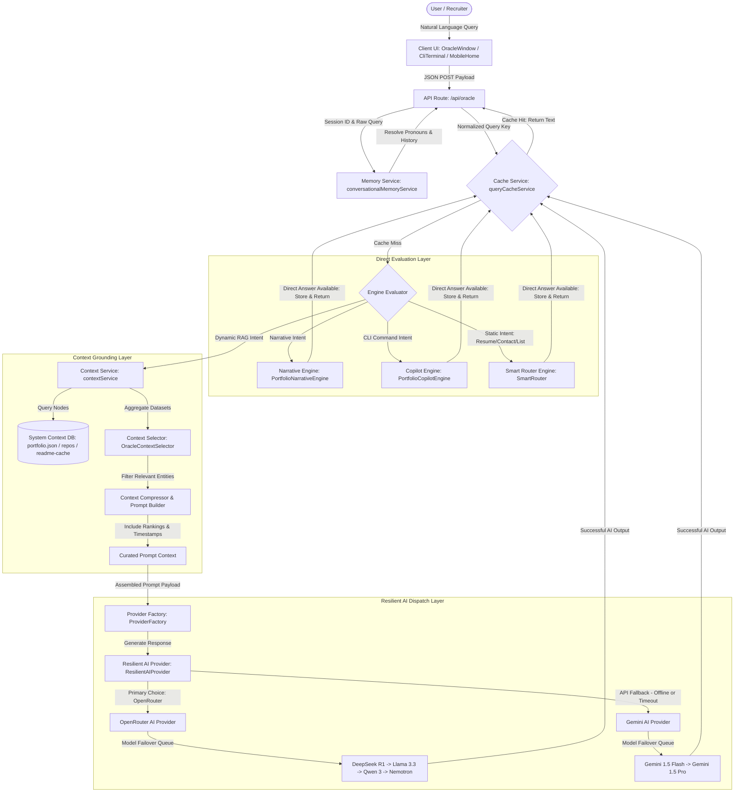

# 🌌 Multiverse-OS

> An AI-powered, interactive developer portfolio operating system and conversational knowledge engine. It provides recruiters, engineering managers, and open-source contributors with structured, instant, and context-aware insights into projects, repository architectures, and technical competencies.

[](https://surajdev.indevs.in)
[](https://github.com/Suraj-codes1410/Multiverse-OS/actions/workflows/ci.yml)
[](https://nextjs.org/)
[](https://www.typescriptlang.org/)
[](https://surajdev.indevs.in)
[](https://opensource.org/licenses/MIT)

**[🌐 Live Production Site](https://surajdev.indevs.in)** | **[💾 GitHub Repository](https://github.com/Suraj-codes1410/Multiverse-OS)** | **[👔 Developer LinkedIn](https://www.linkedin.com/in/suraj-samanta1410/)**

---

## 🎯 Hero & Project Vision

**Multiverse-OS** is an **AI-Powered Interactive Developer Portfolio** designed as an immersive operating-system console. Traditional developer portfolios suffer from static limitations, presenting generic summaries that require technical recruiters to search manually for matches. Multiverse-OS transforms the static candidate review process into a dynamic, queryable experience.

By integrating a custom semantic routing system, query caching, multi-model resilient fallback flows, and a custom retrieval-augmented grounding layer, the platform acts as an intelligent 24/7 autonomous technical representative. Recruiters can query the candidate's codebase directly, evaluate technical trade-offs, inspect live repository telemetry, and verify real-world project scenarios.

---

## 📸 Interface Preview

Below are the primary views of the **Multiverse-OS** environment. 
*(If you are running the project locally, you can capture screenshots and place them in the `docs/screenshots/` directory).*

| **Boot Loading Screen** | **System Console (Home)** |
| :---: | :---: |
|  |  |
| *Tactile, animated boot reveal sequence with OS mode selection landing choice.* | *Immersive, OS-like terminal interface for exploring directories and system metrics.* |

| **Oracle AI Assistant** | **CLI Terminal Shell** |
| :---: | :---: |
|  |  |
| *Semantic search & natural language question-answering with repository grounding.* | *Sleek retro-style developer CLI terminal for commands execution.* |

| **Recruiter Dashboard** | **Mobile View Layout** |
| :---: | :---: |
|  |  |
| *Consolidated insights, quick recruiter queries, resume matching, and candidate stats.* | *Seamless full-screen sheets layout and responsive gestures for mobile viewports.* |

---

## 💡 Why I Built This

Traditional developer portfolios are rigid, passive, and uniform. When recruiters or hiring managers seek to evaluate a candidate:
1. **Manual Search Overhead**: They must open multiple GitHub repositories, parse complex codebase structures, search through PDF resumes, and manually look up technology stack matches.
2. **Lack of Interaction**: Static text fields fail to demonstrate real-time software engineering problem-solving, microservices orchestration, or API design depth.
3. **Information Fragmentation**: Cross-referencing hackathon achievements, geospatial forecasting models, and backend billing services leaves room for missed details.

**The Solution: Oracle conversational access.**  
I built the **Oracle AI Assistant** as the cognitive engine of Multiverse-OS. Instead of clicking links, a visitor can type, *"Explain your experience with microservice coordination in your billing project,"* or *"What did you learn about TimescaleDB performance limits during NASA Space Apps?"* Oracle dynamically traverses the developer's experience database, resolves semantic intent, and fetches relevant repository segments to synthesize a grounded, accurate, and direct response.

---

## ⚙️ Core Feature Breakdown

### Oracle AI Assistant
A context-grounded conversational agent powered by [service.ts](file:///C:/Users/Suraj/multiverse-os/lib/oracle/service.ts) and [contextSelector.ts](file:///C:/Users/Suraj/multiverse-os/lib/oracle/contextSelector.ts). It queries offline resume schemas (`portfolio.json`, `timeline.json`) and repository databases in real-time, executing dynamic prompt formatting to deliver precise technical breakdowns.

### Smart Routing Engine
Implemented in [smartRouter.ts](file:///C:/Users/Suraj/multiverse-os/lib/oracle/smartRouter.ts). It uses a classifier to determine query intent (e.g., `Repository Metadata`, `Technology Lookup`, `Recruiter Insight`, or `General Knowledge`) and extracts entities (technologies, projects, concepts). This ensures the AI model receives target-grounded context rather than generic portfolio dumps.

### Repository Intelligence
Extracts repository structures, commit patterns, project file trees, and custom readme data. It uses [entityResolver.ts](file:///C:/Users/Suraj/multiverse-os/lib/oracle/entityResolver.ts) to map queries to exact codebase files and folders, enabling developers to navigate local code structures interactively.

### Recruiter Intelligence
Specifically tailored to recruiter personas via [RecruiterDashboard.tsx](file:///C:/Users/Suraj/multiverse-os/components/RecruiterDashboard.tsx). Highlights availability, core specializations, work preferences, and offers pre-validated queries matching common HR and sourcing questions.

### Narrative Engine
Developed in [narrativeEngine.ts](file:///C:/Users/Suraj/multiverse-os/lib/oracle/narrativeEngine.ts). Synthesizes technical storylines, compiling the candidate's development journey, hackathon participation paths, and project evolution narratives in response to conversational prompts.

### Portfolio Copilot
Exposed via [copilotEngine.ts](file:///C:/Users/Suraj/multiverse-os/lib/oracle/copilotEngine.ts) and [CliTerminal.tsx](file:///C:/Users/Suraj/multiverse-os/components/CliTerminal.tsx). Offers a command-line interface mimicking a shell environment. Users can run standard Unix-like directory traversal commands, trigger specific diagnostic routines, or command the assistant dynamically.

### Admin Dashboard
A production control pane displaying operational logs, API provider telemetry, cache hit/miss distributions, and diagnostic status of system checks.

### Contact System
An integrated form using the Resend API to securely route messages from recruiters directly to the developer's verified email, ensuring prompt responses to inquiries.

### Resume Intelligence
Parses achievements, historical roles, work experiences, and academic achievements from local data sources to answer precise background questions immediately without parsing a static PDF.

### Secure API Proxy Routing
Protects client-side code from raw filesystem or rate-limited API calls:
* **Route Proxies**: Exposed endpoints `/api/projects` and `/api/repositories` serve aggregated project metadata and synchronized GitHub repository statistics.
* **Internal Routing**: Client components query these local routes, executing dynamic filesystem fetches strictly on the Vercel/Next.js server layer to prevent CORS locks and token leakage.

### Analytics & Observability
Engineered via [analyticsService.ts](file:///C:/Users/Suraj/multiverse-os/lib/oracle/analyticsService.ts). Records telemetry like response latencies, model selection pathways, cache utilization, and query counts. Data is logged locally in [oracle-analytics.json](file:///C:/Users/Suraj/multiverse-os/data/oracle-analytics.json) to measure usage and model performance.

### Premium Performance & Motion
Integrates desktop-grade hardware transitions and micro-interactions:
* **GPU Drag translations**: Offloads dragging coordinates computations from browser layout calculations to composite GPU textures (`translate3d`), guaranteeing fluid 120 FPS window movement.
* **Inertial Scrolling**: Orchestrates scrolling speeds inside application panels using the **Lenis** scroll engine, preventing scroll chaining propagation.
* **Mobile Sheets**: Re-flows mobile viewports using slide-up sheets animations (`rounded-t-3xl`) and accessible 44x44px touch targets.
* **Reduced Motion**: Automatically scales back coordinate animations to fast fades when browser flags `prefers-reduced-motion`.

---

## 📐 System Architecture

### System Overview
Multiverse-OS is an interactive developer portfolio engineered as a virtual desktop operating system environment on the frontend, powered by a semantic search routing, context grounding, and multi-provider resilient AI dispatch layer on the backend. The platform functions as an autonomous technical representative capable of parsing natural language queries, retrieving grounded repository context, and displaying diagnostics through a retro-futuristic workspace.

### High-Level Architecture
The platform is structured into three primary layers:
1. **Desktop/Mobile OS Runtime (Frontend)**: Standardizes window operations (drag, focus, minimize, maximize) on desktop viewports and slides up bottom sheet overlays on mobile viewports.
2. **Oracle AI Cognitive Engine (Backend Services)**: Manages intent classification, dialogue memory mapping, context filtering, and provider resilience.
3. **Synchronization & Cache Layer**: Periodically aggregates readmes and GitHub metadata to service requests locally without constant upstream network costs.

### Mermaid Implementation Diagram
The following diagram illustrates the exact lifecycle of an incoming user query through the system components. All nodes correspond directly to active code files and modules:



### Oracle Request Lifecycle (Step-by-Step Flow)
1. **Submission**: User submits a natural language query via [OracleWindow.tsx](file:///C:/Users/Suraj/multiverse-os/components/OracleWindow.tsx), [CliTerminal.tsx](file:///C:/Users/Suraj/multiverse-os/components/CliTerminal.tsx), or mobile layout.
2. **Post Dispatch**: The client sends a POST request with `query`, `repositoryName`, `sessionId`, and `eventType` to the main backend endpoint [app/api/oracle/route.ts](file:///C:/Users/Suraj/multiverse-os/app/api/oracle/route.ts).
3. **Conversational Memory Resolution**: The query passes through [conversationalMemoryService](file:///C:/Users/Suraj/multiverse-os/lib/oracle/memory.ts) to resolve pronoun dependencies based on previous turns (e.g. converting "how was it built?" into "how was SAHAI built?").
4. **Caching Check**: The query is normalized (lowercase, whitespaces trimmed, punctuation stripped) and checked against [queryCacheService](file:///C:/Users/Suraj/multiverse-os/lib/oracle/queryCache.ts). If a hit occurs, the cached response returns immediately.
5. **Direct Engine Bypasses**:
   * **Narrative Engine**: [PortfolioNarrativeEngine](file:///C:/Users/Suraj/multiverse-os/lib/oracle/narrativeEngine.ts) intercepts milestone, timeline, or university experience queries to generate immediate direct responses without LLM costs.
   * **Copilot Engine**: [PortfolioCopilotEngine](file:///C:/Users/Suraj/multiverse-os/lib/oracle/copilotEngine.ts) intercepts shell commands and career consulting questions to return direct instructions.
   * **Smart Router**: [SmartRouter](file:///C:/Users/Suraj/multiverse-os/lib/oracle/smartRouter.ts) maps static commands (e.g. resume downloads, contact details, project links) to direct returns.
6. **Dynamic RAG Grounding**:
   * [contextService](file:///C:/Users/Suraj/multiverse-os/lib/oracle/service.ts) loads candidate profiling details, project schemas, local readmes, and repository metrics.
   * [OracleContextSelector](file:///C:/Users/Suraj/multiverse-os/lib/oracle/contextSelector.ts) runs a text search on the aggregated context to filter only items matching query entities.
   * If a recruiter intent is detected, [RecruiterInsightEngine](file:///C:/Users/Suraj/multiverse-os/lib/github/recruiterInsightEngine.ts) invokes [ProjectRankingService](file:///C:/Users/Suraj/multiverse-os/lib/github/projectRankingService.ts) to compute ranked project evidence scores.
7. **Prompt Assembly**: Formats the selected context into a structured markdown document, appends repository timestamps, and attaches it to the system instructions defining response behaviors (PORTFOLIO, GENERAL KNOWLEDGE, or HYBRID mode).
8. **Resilient LLM Invocation**:
   * [ProviderFactory](file:///C:/Users/Suraj/multiverse-os/lib/oracle/providerFactory.ts) constructs a `ResilientAIProvider` wrapper.
   * The wrapper tries the primary provider [OpenRouterProvider](file:///C:/Users/Suraj/multiverse-os/lib/oracle/openRouterProvider.ts). If rate limits (429) or timeouts occur, it shifts down the model failover queue (DeepSeek R1 -> Llama 3.3 -> Qwen 3 -> Nemotron).
   * If OpenRouter fails completely or API key configurations are missing, it executes an immediate fallback switch to [GeminiProvider](file:///C:/Users/Suraj/multiverse-os/lib/oracle/geminiProvider.ts).
9. **Finalization**: The response is saved to the local cache and memory, latency metrics are recorded in [oracle-analytics.json](file:///C:/Users/Suraj/multiverse-os/data/oracle-analytics.json) by [analyticsService.ts](file:///C:/Users/Suraj/multiverse-os/lib/oracle/analyticsService.ts), and the completion is sent back to the frontend.

### Directory Responsibilities
* [lib/oracle/](file:///C:/Users/Suraj/multiverse-os/lib/oracle/): Core cognitive pipeline (cache, memory, providers, selectors, routers, startup self-healing).
* [lib/github/](file:///C:/Users/Suraj/multiverse-os/lib/github/): GitHub repository syncing, analysis tools (complexity, architecture), and recruiter insight estimators.
* [desktop/](file:///C:/Users/Suraj/multiverse-os/desktop/): Virtual OS windowing shell, wallpaper renderers, dock managers, and panel menus.
* [mobile/](file:///C:/Users/Suraj/multiverse-os/mobile/): Mobile re-flow overlays, status panels, gestures tracking, and bottom sheets controls.
* [app/api/](file:///C:/Users/Suraj/multiverse-os/app/api/): Next.js Serverless endpoint routers (oracle assistant, secure proxies, health, contact forms).
* [components/](file:///C:/Users/Suraj/multiverse-os/components/): Interactive frontend widgets (terminal CLI, visual strands, ferrofluid graphics, watercolor canvases).
* [shared/](file:///C:/Users/Suraj/multiverse-os/shared/): Reusable UI primitives (buttons, tooltips, cards, window headers, glass panels).
* [data/](file:///C:/Users/Suraj/multiverse-os/data/): Local static knowledge databases (portfolio profiles, hackathons timeline, static sync configurations).

### Frontend Runtime Architecture
* **Window Drag system**: Desktop app window dragging is offloaded from browser layout flows to composite GPU textures using `translate3d(x, y, 0)` offsets.
* **Scroll Chaining Prevention**: Inside scrollable windows, [ScrollProvider.tsx](file:///C:/Users/Suraj/multiverse-os/providers/ScrollProvider.tsx) intercepts mouse wheel events and suspends global Lenis smooth scrolling inside panels having active overflow layouts.
* **Theme customizer**: Workspace appearances are managed on the root document level by swapping high-level color variable mappings (`styles/theme.css`) to dynamically apply Obsidian Dark, Matrix, Cyberpunk, or High Contrast layouts.

### State Management Structure
The frontend operates with a decentralized React Context architecture (no Redux/Zustand overhead):
* `LayoutProvider`: Tracks active window focus stack and Desktop/Mobile layout toggles.
* `ThemeProvider`: Manages active theme styles and canvas visualizers.
* `DockProvider`: Resolves application state registers (minimized, maximized, closed).
* `ShellProvider`: Stores developer terminal commands logs and system directory trees.
* `GestureProvider`: Maps mobile swipe and slide overlay coordinates.

---

## 🚀 Featured Projects

Detailed below are the technical summaries, architectural challenges, and engineering outcomes of my primary projects, retrieved dynamically by the Repository Engine:

### 1. SAHAI — Mental Health & Lifestyle Platform
* **Role**: Lead Full-Stack Architect
* **Context**: Smart India Hackathon 2025 National Participant
* **Tech Stack**: `FastAPI`, `Django`, `React`, `WebSockets`, `MySQL`, `Pinecone`
* **Problem**: Mental health systems struggle to provide immediate, contextual counseling resources and real-time therapist chat interfaces in a unified environment.
* **Solution**: Developed a dual-backend stack utilizing FastAPI for sub-second vector searches and Django for primary authentication, app state, and scheduling. Pinecone coordinates Retrieval-Augmented Generation (RAG) to serve immediate, safe assistance, while WebSockets maintain persistent, lightweight real-time therapist chatrooms.
* **Key Challenge**: Synchronizing WebSocket session lifecycles across scaling instances. Solved by implementing an optimized reconnection loop and backoff queue, eliminating socket memory leaks upon user disconnects.
* **Repository**: [Suraj-codes1410/Sahai](https://github.com/Suraj-codes1410/Sahai)

### 2. ORBITAIR — AI-Powered AQI Forecasting
* **Role**: Backend & Data Engineer
* **Context**: NASA Space Apps Challenge 2025 (Top 5 in India out of 823 teams)
* **Tech Stack**: `FastAPI`, `TimescaleDB`, `React`, `Leaflet`, `Python ML Suite`
* **Problem**: Integrating multi-dimensional spatial data streams from NASA TEMPO satellites, NOAA feeds, and local EPA sensors in real-time, then executing high-performance geospatial queries.
* **Solution**: Configured a FastAPI analytics service querying a TimescaleDB hypertable system partitioned by geo-coordinates and timestamps. Trained time-series forecasting pipelines that output predictions with 98% accuracy, visualizing them via dynamic Leaflet heatmaps.
* **Key Challenge**: Write-locking and ingestion choke points on massive geospatial dataset insertions. Solved by tuning hypertable chunk intervals and introducing asynchronous bulk pipeline ingestion.
* **Repository**: [Suraj-codes1410/orbit-ops](https://github.com/Suraj-codes1410/orbit-ops/tree/OrbitAir_website)

### 3. Patient Management Service
* **Role**: Backend Microservices Engineer
* **Context**: Enterprise Hospital Billing & Domain System
* **Tech Stack**: `Java`, `Spring Boot`, `Kafka`, `gRPC`, `Docker`, `Spring Security`
* **Problem**: Building a reliable, low-latency, role-secured hospital gateway capable of handling high-throughput patient records and billing transactions without database race conditions.
* **Solution**: Structured the system into Spring Boot microservices. Used gRPC binary communication for low-latency internal service calls and Kafka event streaming to trigger billing reconciliation processes asynchronously. Containerized the microservices with Docker and integrated Spring Security OAuth2.
* **Key Challenge**: Ensuring strict transaction consistency across multiple microservices to prevent double-charging or orphan billing states. Solved by deploying an outbox transactional pattern backed by Kafka.
* **Repository**: [Suraj-codes1410/Patient-management-services](https://github.com/Suraj-codes1410/Patient-management-services)

---

## 🛠️ Technology Stack

Below is the complete engineering matrix of the Multiverse-OS platform, divided by layer:

### Frontend
| Technology | Category | Purpose | Details |
| :--- | :--- | :--- | :--- |
| **Next.js 16** | Framework | Server-Side Rendering & Routing | App Router structure, Server Actions, API routes. |
| **React 19** | Library | Declarative UI | Concurrent rendering support, clean hook lifecycle. |
| **Tailwind CSS v4** | Styling | Utility-first Design | High-performance CSS compiling, custom dark themes. |
| **Framer Motion** | Animation | Fluid Transitions | Manages boot sequences, window drags, and console fades. |
| **Lucide React** | Icons | Visual Language | Lightweight vector icons matching OS aesthetics. |

### Backend & API
| Technology | Category | Purpose | Details |
| :--- | :--- | :--- | :--- |
| **Node.js 22** | Runtime | Execution Environment | Local script execution and serverless API execution. |
| **Django & FastAPI** | Frameworks | External Backends | Serving RAG queries, WebSocket streams, and REST routes. |
| **Spring Boot** | Framework | Microservices | Enterprise backends, gRPC routing, and Kafka consumers. |
| **Resend API** | Communication | Contact Handling | Delivering visitor submissions to developer inboxes. |

### AI Infrastructure
| Technology | Category | Purpose | Details |
| :--- | :--- | :--- | :--- |
| **OpenRouter API** | Model Hub | LLM Access Gateway | Serves primary deep learning models (DeepSeek, Llama). |
| **Google Gemini API** | Model Hub | Redundancy Provider | Fallback target when OpenRouter encounters limits. |
| **Pinecone** | Vector DB | RAG Semantics | Storing high-dimensional embeddings for wellness resources. |
| **Smart Router** | Custom Engine | Intent Classification | Classifies queries into 8 specialized intent categories. |

### DevOps & Infrastructure
| Technology | Category | Purpose | Details |
| :--- | :--- | :--- | :--- |
| **GitHub Actions** | CI/CD | Automation | Continuous Integration workflow verifying compile and tests. |
| **Vercel** | Hosting | Cloud Platform | Static assets delivery and serverless functions hosting. |
| **Docker** | Containerization | Environment Sync | Replicating microservices configurations across developers. |

### Analytics & Observability
| Technology | Category | Purpose | Details |
| :--- | :--- | :--- | :--- |
| **TimescaleDB** | Time-Series | Geospatial Aggregation | Fast analysis of AQI metrics and historical telemetry. |
| **JSON Analytics** | Database | Local Usage Auditing | Custom lightweight metrics logging (`oracle-analytics.json`). |
| **Health API** | Telemetry | System Health Checks | `/api/health` endpoint returning modular micro-status. |

---

## 🎨 Theme & Visual Customization (PastelOS)

Multiverse-OS supports dynamic workspace theme customization. Rather than relying on simple styling toggles, the system uses responsive CSS Custom Properties to completely alter the visual material layers:

* **PastelOS (Default)**: A light, warm, and minimal editorial default theme. Features a soft pastel blue-green background grid (`#DCEBE8`), warm ivory/cream window backgrounds (`#F7F2EB`), solid paper-white cards (`#FFFFFF`), a friendly custom-designed SVG companion robot, and terracotta accents (`#E06A3F`).
* **Obsidian Dark**: A clean, low-contrast obsidian developer workspace featuring neon cyan accents.
* **Cyberpunk**: A retro-futuristic dark mode theme using neon pink and neon cyan glow aesthetics.
* **Matrix**: A green-on-black digital terminal layout simulating slow-scrolling binary matrices.
* **High Contrast**: A system-compliant high-accessibility layout utilizing strict black-and-white borders.

---

## 🛡️ Reliability & Engineering Architecture

The platform is designed to operate continuously under strict resource constraints, featuring several production-grade recovery patterns:

### 1. Multi-Provider API Failover
The platform leverages a resilient architecture in [providerFactory.ts](file:///C:/Users/Suraj/multiverse-os/lib/oracle/providerFactory.ts) which acts as a wrapper around the AI providers. If the primary provider (e.g., OpenRouter) throws an exception (e.g., key exhaustion, authentication issues, rate limits), the wrapper catches the error, logs a `PROVIDER_FALLBACK` event, checks for `GEMINI_API_KEY`, and hot-swaps to the Gemini API provider immediately.

### 2. Multi-Model Failover Queue
Inside [openRouterProvider.ts](file:///C:/Users/Suraj/multiverse-os/lib/oracle/openRouterProvider.ts), requests process through a progressive model chain:
$$\text{DeepSeek-R1 (Primary)} \longrightarrow \text{Llama-3.3-70B} \longrightarrow \text{Qwen-3-32B} \longrightarrow \text{Nemotron-550B}$$
If a model fails due to 429 rate limits, timeouts, or capacity issues, the engine detects whether the error is retryable and transparently targets the next fallback model.

### 3. Smart Caching Strategy
Implemented in [queryCache.ts](file:///C:/Users/Suraj/multiverse-os/lib/oracle/queryCache.ts), the caching service normalizes queries (stripping white space and punctuation) and dynamically assigns Time-To-Live (TTL) targets depending on classification:
* **Repository Metadata Queries**: 5-minute cache (fast synchronization checks).
* **Repository Structure Questions**: 30-minute cache.
* **Portfolio & Career Questions**: 1-hour cache (infrequently updated resume data).
* **General Knowledge Questions**: 24-hour cache (e.g., conceptual questions).

### 4. Serverless Vercel Compatibility
Background timer threads (like cache eviction cleanup loops) can prevent serverless functions from completing or cause CPU execution overhead in freezing environments. The platform detects `process.env.VERCEL === '1'` and suspends background setInterval tasks, ensuring compliant and high-performance serverless executions.

### 5. Automated Local Self-Healing
If local database logs or caches become corrupted or missing, [recoveryManager.ts](file:///C:/Users/Suraj/multiverse-os/lib/oracle/recoveryManager.ts) intercepts the parser errors. It rebuilds a clean cache structure (`github-sync-cache.json` or `oracle-analytics.json`) on the fly, preventing startup crashes.

### 6. Graceful Degradation & Timeout Controls
Upstream connections feature explicit timeouts: 10s for the GitHub API, and 30s for LLM providers managed via `AbortController`. If connections fail or exceed limits, the system halts calls and serves static fallback definitions instead of hanging.

---

## 💬 Example Oracle Queries

You can interact with the **Oracle AI Assistant** using the queries below, grouped by category:

### Portfolio & Career Intelligence
* *"What is Suraj's current availability for full-time engineering roles?"*
* *"Tell me about your academic achievements and university major."*
* *"List the hackathons you have participated in and your achievements."*

### Recruiter & Sourcing Insight
* *"Is Suraj open to remote positions, and what are his relocation terms?"*
* *"Does his technical experience match Python and Spring Boot microservices?"*
* *"Can you provide a summary of his work history and core roles?"*

### Repository & Codebase Grounding
* *"Explain how the multi-provider failover mechanism works in your code."*
* *"Which files manage your Oracle query caching and data normalization?"*
* *"Provide a structural breakdown of the ORBITAIR forecasting backend."*

### General Technical Knowledge
* *"Why did you select TimescaleDB over a standard relational database for AQI data?"*
* *"Explain the trade-offs of using gRPC versus REST for microservice routing."*

---

## 🛠️ Local Development

Follow these steps to clone, configure, and run the Multiverse-OS platform on your local machine:

### Prerequisite Environment Variables
Before running the server, copy the configuration template and populate the variables:
```bash
cp .env.example .env.local
```
Fill out the keys in `.env.local`:
* `OPENROUTER_API_KEY`: API Key from [OpenRouter](https://openrouter.ai/).
* `GEMINI_API_KEY`: API Key from [Google AI Studio](https://aistudio.google.com/).
* `GITHUB_TOKEN`: Classic or Fine-grained Personal Access Token from GitHub (required to avoid API rate limit restrictions during repo syncing).
* `RESEND_API_KEY`: Integration key from [Resend](https://resend.com) for sending notification emails.
* `CONTACT_EMAIL`: The recipient email address for visitor submissions.

### Installation & Startup
1. **Clone the repository**:
   ```bash
   git clone https://github.com/Suraj-codes1410/Multiverse-OS.git
   cd Multiverse-OS
   ```
2. **Install dependencies**:
   ```bash
   npm install
   ```
3. **Execute the local development server**:
   ```bash
   npm run dev
   ```
4. **Open the interface**:
   Navigate to [http://localhost:3000](http://localhost:3000) inside your web browser.

### Code Style & Quality Verification
Verify code health and formatting styles before committing changes:
* **Style Check**: Runs Prettier style validation rules:
  ```bash
  npm run format:check
  ```
* **Linting Check**: Runs ESLint code quality checks:
  ```bash
  npm run lint
  ```
* **TypeScript Compilation**: Checks type safety across components:
  ```bash
  npx tsc --noEmit
  ```
* **Integration Tests**: Executes the 37-scenario Oracle validation suite:
  ```bash
  npm run test
  ```

---

## 🔄 CI/CD & Deployment Workflow

### GitHub Actions CI/CD Pipeline
The platform utilizes a production-ready, parallelized GitHub Actions workflow ([ci.yml](file:///C:/Users/Suraj/multiverse-os/.github/workflows/ci.yml)) to validate every push, pull request, or manual trigger:

* **Validate Job**: Runs Prettier style checking (`npm run format:check`), ESLint parsing (`npm run lint`), and lockfile synchronization checks in parallel.
* **Typecheck Job**: Performs full TypeScript type safety verification (`npx tsc --noEmit`).
* **Build & Test Job**: Executes Next.js production builds and runs the 37-scenario Oracle Integration Suite.

```
                          ┌── Push / PR ──┐
                          ▼               ▼
                    ┌───────────┐   ┌───────────┐
                    │ Validate  │   │ Typecheck │
                    └─────┬─────┘   └─────┬─────┘
                          ▼               ▼
                    ┌───────────────────────────┐
                    │       Build & Test        │
                    └───────────────────────────┘
```

### Continuous Deployment
* **Hosting Platform**: Vercel.
* **CD Trigger**: Successful completion of the CI pipeline on the `main` branch.
* **Auto-Promotion**: Merging into `main` builds, packages, and pushes updates live to [https://surajdev.indevs.in](https://surajdev.indevs.in).

---

## 👔 Developer Profiles

* **Developer Name**: Suraj Samanta
* **LinkedIn**: [suraj-samanta1410](https://www.linkedin.com/in/suraj-samanta1410/)
* **GitHub**: [Suraj-codes1410](https://github.com/Suraj-codes1410)
* **Email**: Contact through the portfolio interface's secure contact card.