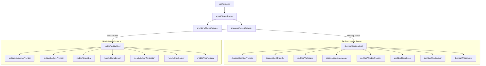

# Application Shell Architecture Documentation

This document describes the dual-layout shell architecture designed to segregate desktop and mobile user experiences completely, ensuring clean code-splitting, targeted inputs handling, and simplified layouts logic.

---

## 🏗️ Architecture Blueprint

---

## 🖥️ Desktop Shell Layout System (`desktop/`)

The desktop system replicates a complete windows-based desktop interface.

* **`DesktopShell`**: The root wrapping component layout. Mounts the backing grids wallpaper, the floating widget layers, the active windows manager, the agentic web controls overlay, and the chatbot sidebar overlay.
* **`DesktopProvider` & `DesktopContext`**: Context provider tracks active/focused windows and coordinates drag-and-drop layering priorities.
* **`WindowManager`**: Orchestrates open widgets frames, clamping boundaries, and rendering dimensions.
* **`WindowRegistry`**: Maintains titles, initial positioning metrics, and dimensions constants of windows (e.g. CLI console, Recruiter matches dashboard, Skills tree).
* **`DockProvider`**: Manages state, collapse conditions, and mouse focus of the quick launch control panel.
* **`Wallpaper`**: Renders responsive SVG background grid matrices, custom neon primary radial meshes, and active gradients.
* **`RobotLayer`**: Controls floating visual highlight animations when AI background agents interact with portfolio elements.
* **`OracleLayer`**: Sidebar panel wrapping the Oracle AI conversational assistant chat box.
* **`WidgetLayer`**: Coordinates overlay status widgets, graphs, and performance metrics charts.

---

## 📱 Mobile Shell Layout System (`mobile/`)

The mobile system mimics native application shells with touch interactions and responsive sections.

* **`MobileShell`**: Root wrapper establishing mobile layout flow. Mounts status bars, scrolling layouts, sliding assistant overlays, and touch navigation rows.
* **`NavigationProvider`**: Context manager matching user tab triggers (e.g., console logs, profile details, oracle assistant).
* **`AppRegistry`**: Defines metadata, badge indicators, and labels of available application blocks.
* **`BottomNavigation`**: Bottom action bar containing touch buttons for fast tab-switching.
* **`HomeLayout`**: Smooth scrolling viewport managing nested mobile pages.
* **`StatusBar`**: Mock mobile status header displaying LTE/5G markers, battery meters, and portfolio build alerts.
* **`OracleLayer`**: Bottom-drawer overlay sliding up when Oracle chat is toggled.
* **`GestureProvider`**: Tracks screen drag actions to allow swiping panels open or closed.

---

## 🔗 Shared Infrastructure Layer

* **`SharedLayout`**: The universal HTML body wrapper. Sets up antialiased configurations and standardizes font weights.
* **`LayoutProvider`**: Directs viewport sizing, dynamically setting `'desktop' | 'mobile'` parameters based on matchMedia queries.
* **`ThemeProvider`**: Tracks active theme values (`'default' | 'cyberpunk' | 'matrix' | 'high-contrast'`), modifying the `data-theme` selector on the root element.
